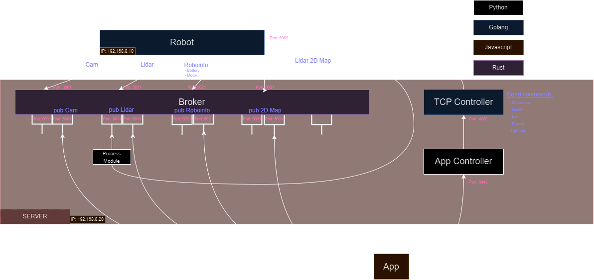

# Microservice Architecture Overview

Our microservice architecture is designed to handle real-time data streams from various sensors, including cameras and LiDAR, process this data, and distribute it to other services within our ecosystem. Below is an outline of the architecture components and their roles:

## Overview

## Core Components

### Broker service
- **Purpose**: Acts as the entry point for sensor data streams.
- **Functionality**:
  - Listens for incoming data on specified TCP ports.
  - Processes and forwards the data to TCP or Websocket clients

### AI Processing Service (example)
- **Purpose**: Consumes data from Kafka and applies AI models for analysis and decision-making.
- **Technologies**:
  - TensorFlow or PyTorch for machine learning computations.
- **Functionality**:
  - Performs tasks such as object detection, pathfinding, and predictive analytics.

### Pathfinding Service (example)
- **Purpose**: Generates optimal paths for navigation based on processed data.
- **Technologies**:
  - A* or D* algorithms for path calculation.
- **Functionality**:
  - Subscribes to relevant Kafka topics to receive processed sensor data.
  - Calculates and publishes navigation paths back to Kafka.

### Client Communication Service
- **Purpose**: Interfaces with the Electron frontend application.
- **Technologies**:
  - WebSockets for bi-directional communication.
- **Functionality**:
  - Sends real-time data updates to the Electron app.
  - Receives user commands and forwards them to appropriate services.
