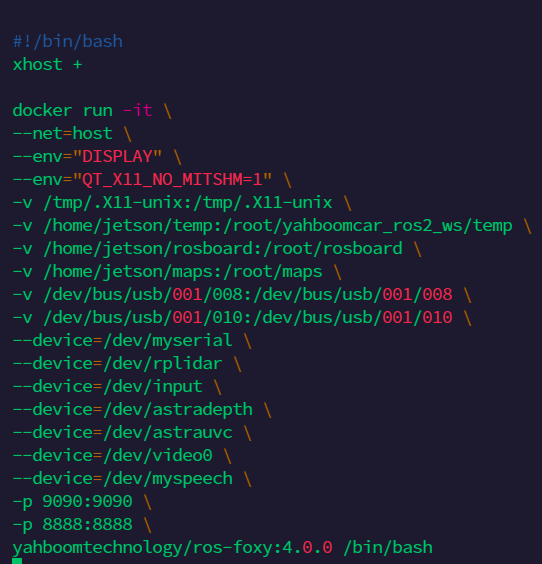

# Setup of Rosmaster X3
## Operating System
1. Download the [Rosmaster X3](https://drive.google.com/drive/folders/1nyf-BhgrBftryZCUAIYJwh2Tsl45R1Ju) software and extract it
2. Flash USB stick with this software
3. Insert USB stick into Rosmaster X3

## Docker Contaier
Run the command lsusb.
```yaml
lsusb 
``` 
Usually there are two Bus 001 devices without a name.

In this case the devices are 008 and 010.

Afterwards you need to run this command... 
```yaml
vim run_docker.sh
``` 
...and change the last numbers accordingly.
```yaml
-v /dev/bus/usb/001/008:/dev/bus/usb/001/008 \
-v /dev/bus/usb/001/008:/dev/bus/usb/001/010 \
```



