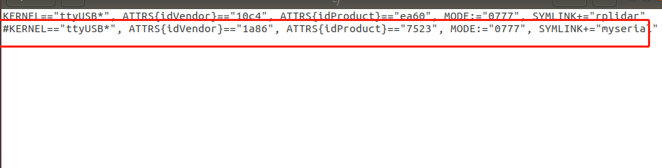
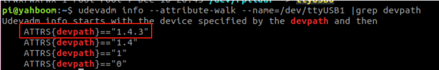

# Information to Voice Module
## Setup
The voice module can be set up using [this Documentation](http://www.yahboom.net/study/ROSMASTER-X3#!).

First you have to run this command.
```yaml
sudo gedit /etc/udev/rules.d/usb.rules
```
Before binding, comment out the line that includes "myseria", with a "#". Otherwise the voice board and the ROS extension board will be identified as the same device. It needs to be saved and quit.

Then run the following commands.
```yaml
sudo udevadm trigger
sudo service udev reload
sudo service udev restart
```
Then the ROS expansion board needs to be binded.

Afterwards you have to run this command.
```yaml
ll /dev/ttyUSB*
```
It will show all the USB devices.
If it shows two you can follow the documentation linked above,
if it shows three you have to plug out the white cable of the voice module, run the "ll /dev/ttyUSB*" command again.
Now you know which one the voice module was, you can plug the cable in.
Two more devices to identify.

When you run this command...
```yaml
ll /dev/rplidar
```
...you will see which of those is the lidar.
That leaves the last one to be the ROS extension board.

Then run this command with the name of the extension board instead of "ttyUSB1".
```yaml
udevadm info --attribute-walk --name=/dev/ttyUSB1 |grep devpath
```
You will see all the devpaths. The first one is important.



Now run this command,
```yaml
sudo gedit /etc/udev/rules.d/myserial.rules
```
add the content shown below and modify the "ATTRS{devpath}=="1.4.3"" to your first devpath
```yaml
KERNEL=="ttyUSB*",ATTRS{devpath}=="1.4.3",ATTRS{idVendor}=="1a86",ATTRS{idProduct}=="7523",MODE:="0777",SYMLINK+="myserial"
```
Then save and exit and reload with the following commands.
```yaml
sudo udevadm trigger
sudo service udev reload
sudo service udev restart
```